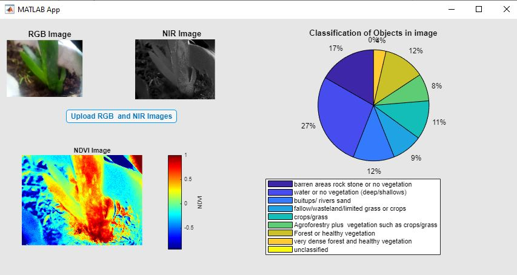
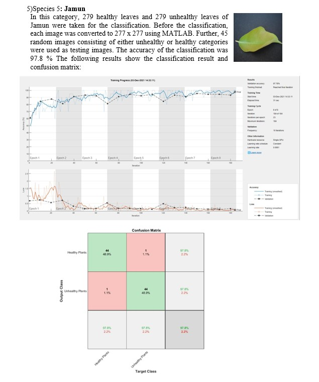

# NDVI and 2D-CNN Plant Leaf Classification

This repository contains MATLAB implementations for classifying plant leaves based on NDVI and deep learning using 2D-CNN (AlexNet). It includes MATLAB App Designer integration, image pre-processing for training, and classification of healthy and diseased plant leaves.

## Table of Contents
- [Introduction](#introduction)
- [Script Code](#script-code)
  - [Image Resizing](#image-resizing)
  - [NDVI Classification Using MATLAB App Designer](#ndvi-classification-using-matlab-app-designer)
  - [2D-CNN Classification Using AlexNet](#2d-cnn-classification-using-alexnet)
- [Dataset](#dataset)
- [Results and Analyses](#results-and-analyses)
- [Usage](#usage)

## Introduction

This project aims to classify plant leaves into healthy and unhealthy categories using two main methods:  
1. NDVI-based classification through MATLAB App Designer.
2. Deep learning classification using a 2D Convolutional Neural Network (CNN) based on AlexNet.

### Key Objectives:
- Perform NDVI-based image classification using near-infrared (NIR) and RGB images.
- Use transfer learning on AlexNet for classification of diseased and healthy plant leaves.
- Integrate NDVI and CNN classification in a MATLAB App Designer interface.


### NDVI Classification Using MATLAB App Designer

The MATLAB App Designer interface allows users to input two sets of images (NIR and RGB) for NDVI classification. It outputs the NDVI image and classifies objects in the image.

#### Main Features:

*   Input NIR and RGB images.
    
*   Generate NDVI images.
    
*   Classify vegetation based on the NDVI values.

## NDVI Application Developed in MATLAB 
The NIR_RGB.m script implements a NDVI calculator.

Here is the result for the NDVI classification:




### 2D-CNN Classification Using AlexNet

The DL\_classifier.m script implements a deep learning-based classification using AlexNet. It trains a model on plant leaf images and classifies them as healthy or diseased.

## Download Dataset

The following species were considered for classification, each having images of healthy and unhealthy leaves:

| Species Name           | Healthy Leaves | Unhealthy Leaves | Image Size (pixels) |
|------------------------|----------------|------------------|---------------------|
| Alstonia Scholaris     | 179            | 179              | 227 x 227           |
| Mango                  | 170            | 170              | 227 x 227           |
| Lemon                  | 159            | 159              | 227 x 227           |
| Guava                  | 142            | 142              | 227 x 227           |
| Jamun                  | 279            | 279              | 227 x 227           |
| Pomegranate            | 272            | 272              | 227 x 227           |
| Pongamia Pinnata       | 276            | 276              | 227 x 227           |

Dataset source: Chouhan, Siddharth Singh, Uday Pratap Singh, Ajay Kaul, and Sanjeev Jain. "A data repository of leaf images: Practice towards plant conservation with plant pathology." In *2019 4th International Conference on Information Systems and Computer Networks (ISCON)*, IEEE, 2019, pp. 700-707.

Each image was resized to fit CNN architecture. Code to resize pictures is also provided.

Results and Analyses
--------------------

### Summary of Deep Learning Classification Accuracy

The accuracy results for the classification of each species are summarized below:

| Species Name            | Accuracy (%) |
|-------------------------|--------------|
| Alstonia Scholaris      | 91.4         |
| Mango                   | 100          |
| Lemon                   | 82.7         |
| Guava                   | 100          |
| Jamun                   | 97.8         |
| Pomegranate             | 97.1         |
| Pongamia Pinnata        | 96.7         |

From the results, we can conclude that the combination of vegetation index (NDVI) and artificial intelligence techniques like 2D-CNN can effectively classify healthy and diseased plant leaves.

## Jamun Result

Here is the result for the Jamun species classification:



The classification accuracy and other relevant details are discussed above.


### References

1. Brown, M. and Süsstrunk, S., “Multi-spectral SIFT for scene category recognition.” In *CVPR 2011*, IEEE, 2011, pp. 177-184.

2. Chouhan, Siddharth Singh, Uday Pratap Singh, Ajay Kaul, and Sanjeev Jain. "A data repository of leaf images: Practice towards plant conservation with plant pathology." In *2019 4th International Conference on Information Systems and Computer Networks (ISCON)*, IEEE, 2019, pp. 700-707.
3. https://www.mathworks.com/help/wavelet/ug/classify-time-series-using-wavelet-analysis-and-deep-learning.html
4. Chamara, N. (2021). Development of an Internet of Things (IoT) Enabled Novel Wireless Multi Sensor Network for Infield Crop Monitoring.


## Script Code

### Image Resizing

The `Image_Resizev2.m` script resizes large plant leaf images to a resolution of 227 x 227 pixels, making them suitable for input into AlexNet for 2D-CNN classification.

### 2D-CNN Classification Using AlexNet

The DL\_classifier.m script implements a deep learning-based classification using AlexNet. It trains a model on plant leaf images and classifies them as healthy or diseased.


## Citing This Repository

If you find this repository useful for your research, please cite it as follows:

Adarsha. (2024). *NDVI-and-2D-CNN-Plant-Leaf-Classification*. GitHub. https://github.com/adarsha30735/NDVI-and-2D-CNN-Plant-Leaf-Classification


#### Full Code:
```matlab
DatasetPath = ('E:\\UNL\\semester 1\\CSI 8300 cv and ıp\\PA_B\\leaf\\Test\\Pongamia Pinnata (P7)');
images = imageDatastore(DatasetPath, 'IncludeSubfolders', true, 'LabelSource', 'foldernames');
numTrainFiles = 230;
[TrainImages, TestImages] = splitEachLabel(images, numTrainFiles, 'randomize');

net = alexnet;
layersTransfer = net.Layers(1:end-3);
numClasses = 2;
layers = [
    layersTransfer
    fullyConnectedLayer(numClasses, 'WeightLearnRateFactor', 20, 'BiasLearnRateFactor', 20)
    softmaxLayer
    classificationLayer
];

options = trainingOptions('sgdm', 'MiniBatchSize', 20, 'MaxEpochs', 8, 'InitialLearnRate', 0.0001, 'Shuffle', 'every-epoch', 'ValidationData', TestImages, 'ValidationFrequency', 10, 'Verbose', false, 'Plots', 'training-progress');
netTransfer = trainNetwork(TrainImages, layers, options);

Ypred = classify(netTransfer, TestImages);
YValidation = TestImages.Labels;
accuracy = sum(Ypred == YValidation) / numel(YValidation);

% Plot confusion matrix
plotconfusion(YValidation, Ypred);


#### Full Code:
```matlab
output_address = ('E:\\UNL\\semester 1\\CSI 8300 cv and ıp\\PA_B\\leaf\\Test\\Pongamia Pinnata (P7)\\Unhealthy Plants');
current_folder = dir('E:\\UNL\\semester 1\\CSI 8300 cv and ıp\\PA_B\\leaf\\Test\\Pongamia Pinnata (P7)\\diseased\\*.jpg');

for i = 1 : length(current_folder)
    current_image = current_folder(i).name;
    Img = imread(fullfile(current_folder(i).folder, current_image));
    j = imresize(Img, [227, 227], 'bilinear');
    imwrite(j, fullfile(output_address, current_image));
end
